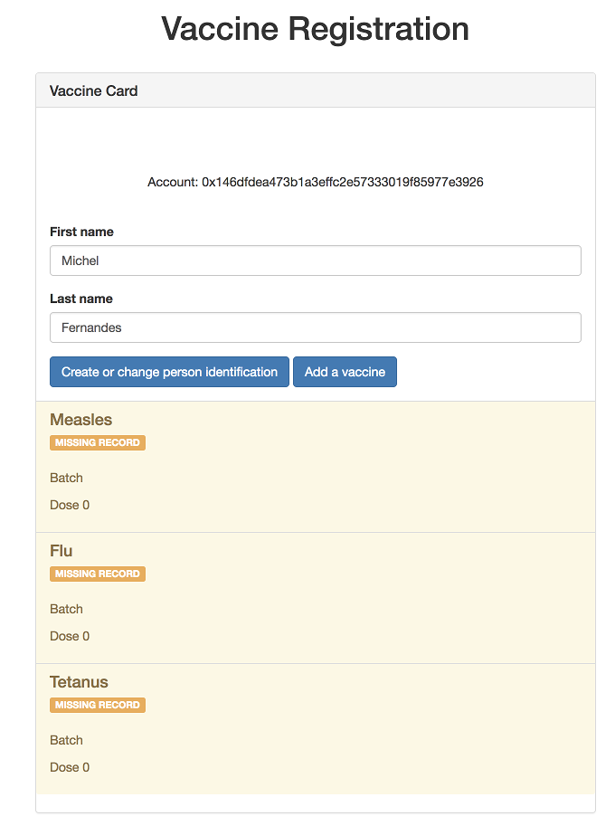
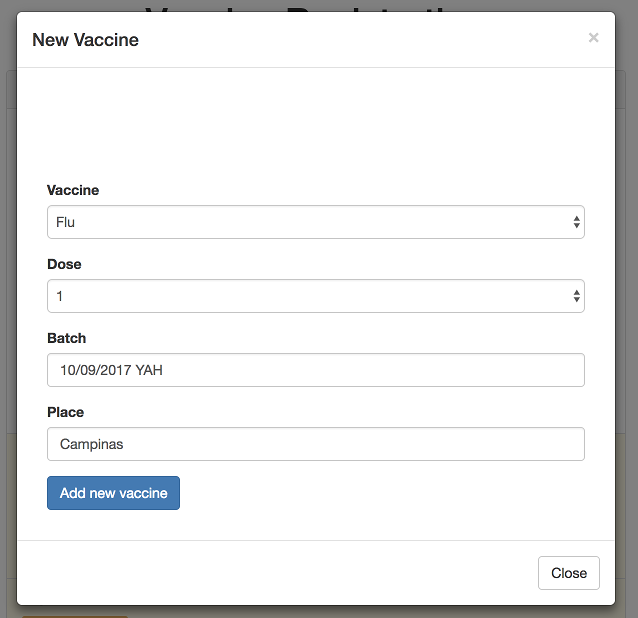

# DApp Vaccine Control
Vaccine Control DApp based on Ethereum Blockchain

_This application was used in [IMasters Webminar](https://www.eventials.com/imasters/blockchain-dapps-construindo-uma-aplicacao-descentralizada-com-ethereum), the presentation PDF is [here](https://github.com/michelpf/bck-eth-dapp-vaccine-control/raw/master/docs/20181010%20Blockchain%20Dapps.pdf), in portuguese (pt-br)_ 😛

## Introduction

This is a proof-of-concept project to explain how Smart Contracts works on Ethereum blockchain platform.
The main goal is to create a registration control for vaccines under blockchain to enable more control and allow third party solutions to get updated information without paper dependencies.

## Utilization

The main screen will show the first and last name connected to the current digital wallet and related vaccines registered. This wallet usually supported by Metamask.

For new users and vaccine updates, first you need to click on "Create or change person identification". 

<p align="center"> 
  
</p>

Once you have a identification ready, move to "Add vaccine" and select the proper vaccine and fill the fields to register or update a new one.

<p align="center"> 
  
</p>

## Installation 

Follow the steps below to download, install, and run this project.

### Dependencies

Install these prerequisites to follow along with the tutorial. See free video tutorial or a full explanation of each prerequisite.

- NPM: https://nodejs.org
- Truffle: https://github.com/trufflesuite/truffle
- Ganache: http://truffleframework.com/ganache/
- Metamask: https://metamask.io/


### Step 1. Clone the project
`git clone hhttps://github.com/michelpf/bck-eth-dapp-vaccine-control`

### Step 2. Install dependencies
```
$ cd bck-eth-dapp-vaccine-control
$ npm install
```
### Step 3. Start Ganache
Open the Ganache GUI client that you downloaded and installed. This will start your local blockchain instance.

### Step 4. Compile & Deploy Election Smart Contract
`$ truffle migrate --reset`
You must migrate the election smart contract each time your restart ganache.

### Step 5. Configure Metamask
See free video tutorial for full explanation of these steps:
- Unlock Metamask
- Connect metamask to your local Etherum blockchain provided by Ganache.
- Import an account provided by ganache.

### Step 6. Run the Front End Application
`$ npm run dev`
Visit this URL in your browser: http://localhost:3000
